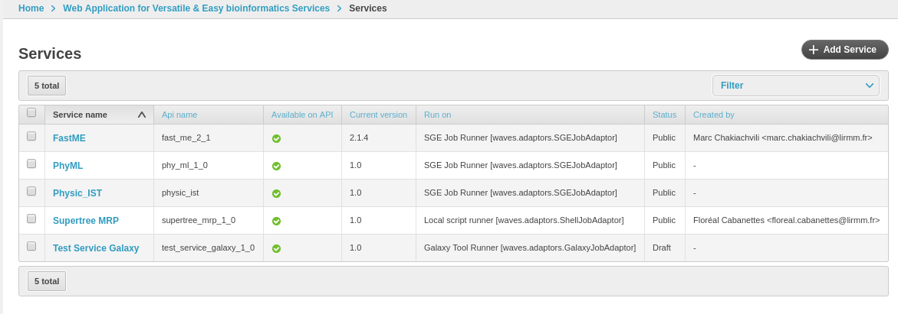

.. _service-admin-label:

Services Administration
=======================

How to configure a service in WAVES application

Service List
------------
 This is landing page when you click on 'Services' Links in Admin home page, you can see current list of services
 registered on your platform

Click on **+ Add Service** to create a new service

Service Creation
----------------

1. General options
    Here you can set general information about you service:

    - *Category* : The associated Category
    - *Service Name* : Service name
    - *Runner configuration* : Runner Adaptor setup (select box from Runner Administration :ref:`runner-admin-label`.)
    - *Descriptions* : Description and short description
    - *Version* : Current version

    .. figure:: backoffice/service-general.png
        :width: 90%
        :align: center

2. Detailed options
    Detailed options presents other details about your service:

    - *Api name* : Currently defined api_name
    - *Created By* : Current Service Owner, if you are not 'superuser', you can't change this value
    - *Access restriction* : When service online status is 'restricted', along with all staff members, you can grant other 'web user' access to your service
    - *Mail Notification* : Check or uncheck mail notification for this Service (this is disabled if configuration disallow it globally)
    - *Api availability* : Set whether service is available on api as well as on the web
    - *Command Class* : Parser Class : dedicated for specific and very complex command, set the :ref:`waves.commands.command.BaseCommand` class implementation to create a job command line
    - *TimeRecord* : Creation and last update date, you can't set these values, they are assigned automatically

    .. CAUTION::
        Modify *api_name* attribute when service is online can produce strange side effect (particularly for your api clients)

    .. figure:: backoffice/service-detail.png
        :width: 90%
        :align: center

3. Meta information
    Meta are defined by : 'some extra info you can add alongside your service description'
    They appear in FrontEnd in right column on your service auto generated page.

    Meta types are:

    - *META_WEBSITE* : 'Online resources'
    - *META_DOC* : 'Documentation'
    - *META_DOWNLOAD* : 'Downloads'
    - *META_FEATURES* : 'Features'
    - *META_MISC* : 'Miscellaneous'
    - *META_PAPER* : 'Related Paper'
    - *META_CITE* : 'Citation'
    - *META_USER_GUIDE* : 'User Guide'
    - *META_CMD_LINE* : 'Command line

    .. figure:: backoffice/service-meta.png
        :width: 90%
        :align: center

4. Runner Adaptor configuration
    Specifically for each Adaptor configured in WAVES, some parameters need to be setup for your 'Runs' configuration.

    - *Parameters* : Parameter list is fixed, you must set all values needed if no default is provided.
    - *Import From Runner* : If currently defined Run configuration allow direct import (such as GalaxyRunner), you may import your tools from it with 'Import From Runner' button, in right top corner

    .. CAUTION::
        These configuration fields are only available when you first save your Service, where you have setup a Runner (see General Options)

    .. figure:: backoffice/service-runner.png
        :width: 90%
        :align: center

5. Submission
    For each services, you can setup multiple ways to submit a job, for example if your service may have a 'standard'
    inputs list, and some 'experts' one for another type of jobs. Inputs in each submission configuration are not
    necessarily correlated.
    For each 'Submission configuration', you can add, remove, order possible inputs.

    Service Inputs:
        You may add as many input as required for your service on this page.

        Each Input needs:

        - *Label* : nice display for your input in forms
        - *Type* : which determine the way parameters are setup in command line (as an option, a positional param, named param etc.)
        - *Name* : this is the actual parameter name used in command line or in job submission
        - *Control Type* : This field setup the type of the input (file, text, int, bool, list, float)
        - *List* : Display (for Control type list only!): how you want to display list items (radio / chekboxes / select)
        - *Submitted by user* : if checked, this input will be shown in JobSubmission webpage, and on API, if not, Input needs a default value (i.e for some reason, you set a kind of 'constant' for your job submission)
        - *Type format* : depending on 'Control Type', you may set here allowed values for the fields (this is not an option for 'list' typed element)
        - *Default* : default value for your input
        - *Description* : short help text displayed in both api and Web pages
        - *Multiple* : checked means that this input can hold multiple values, typically when you want to submit multiple files for the same input for your script
        - *Mandatory* : is checked, form and api calls cannot be submitted if no value is set (or default in case your input is not submitted by user)

        .. figure:: backoffice/service-input.png
            :width: 90%
            :align: center

    Related Inputs
        Sometime, your services may setup dependencies between inputs, for exemple, if you setup a service which use
        DNA or Protein substitution models, you may want to change these models upon selection of type of data.

        So, to help you, WAVES allows to add "Related input" to a service input (down Service Input form part), where
        you can set exactly the same values as for a normal input, **plus** :

        - *When condition* : Activation value (from 'parent' Input), if parent is a list, correspond to selected value

        .. TIP::
            First save with "Save and Continue editing" to have a select from possible values in 'When condition' field

        .. ATTENTION::
            Related inputs can't be 'mandatory', because their submission is dependent on another one which potentially is not set

    Service Outputs
        Along with your service inputs, you want to setup all expected outputs for each jobs.

        A service output is defined by:

        - *Name* : the displayed name for your output
        - *From Input* : sometime, script uses some inputs values to setup outputs file names.
        - *File Name* : output file name, may contains a '%s' pattern referencing associated input value for creating file name
        - *Description* : show on form a little help message about content displayed with output
        - *Output Valuated from Input* :
            if *From input* is checked, you must setup associated input, one per defined submission, failing to do this will aim to not working service

        .. figure:: backoffice/service-output.png
            :width: 90%
            :align: center

    Service ExitCodes
        .. NOTE::
            This is not fully implemented yet, but this data should hold the different possible exit code for your scripts execution

        Here you can define:

        - *Exit Code Value* : expected exit code (should be an int value)
        - *Message* : Associated message to display
        - *Associated job Status* : whether or not to change job final status if exit code occurred

6. Service Sample

    Each input from file type may give some 'sample' content to test service.

    - *Name* : Display named for this sample
    - *Input* : Related file input
    - *Dependent inputs* : if user choose this sample, some other parameter may be set accordingly, setting values can be given here.

    .. figure:: backoffice/service-sample.png
        :width: 90%
        :align: center

